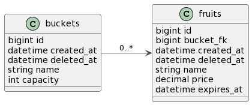

# Where are my fruits?

Gerenciamento de frutas em baldes conforme [desafio](./docs/desafio_backend_planne.pdf)

[> Quadro de planejamento](https://github.com/users/viniosilva/projects/1/views/2)

## Requisitos

Para executar a API é necessário instalar as seguintes ferramentas:

- [go](https://tip.golang.org/doc/go1.20)
- [docker](https://www.docker.com/)
- [docker-compose](https://docs.docker.com/compose/)
- [gnu make](https://www.gnu.org/software/make/manual/make.html)

## Construído com

- [gin](https://gin-gonic.com)
- [gorm](https://gorm.io)
- [mysql](https://www.mysql.com)
- [swagger](https://swagger.io)
- [mockgen](https://github.com/golang/mock)
- [golang-migrate](https://github.com/golang-migrate/migrate/tree/master/cmd/migrate)
- [swaggo](https://github.com/swaggo/swag)

## Instalando

```bash
$ make
```

## Configurando

- Copie o arquivo `.env.example` para `.env`

### Migração da base de dados

Depois de rodar `docker-compose up -d`, é necessário esperar alguns segundos até a subida completa da base de dados para rodar o `make db/migration` para a criação das tabelas do banco de dados MySQL.

```bash
$ make infra/up
$ make db/migration
```

## Rodando

```bash
$ make run
```

É possível acessar a documentação local das rotas no [swagger](http://localhost:3001/api/swagger/index.html)

## Testando

```bash
# Testes unitários
$ make tests

# Cobertura dos testes unitários
$ make tests/cov

# Testes E2E
$ make tests/e2e
```

OBS: ao executar os testes E2E todas as tabelas do banco de dados Docker serão resetadas!

## Diagrama de entidade-relacionamento



## Estrutura de pastas

Estrutura de pastas conforme o [golang-standards](https://github.com/golang-standards/project-layout):

- `/api`: arquivos de configuração APIRest
    - `/middlewares`: interceptação de requisiçoes
    - `server.go`: configuração RestAPI e das rotas
- `/configs`: arquivos de configuração
- `/docs`: documentações
- `/internal`: código privado da aplicação
    - `/controllers`: orquestração dos dados recebido pela requisição
    - `/dto`: objetos de transferência de dados entre as camadas 
    - `/exceptions`: objetos representativos de erros conhecidos pela aplicação 
    - `/factories`: estrutura de criação e injeção das dependências
    - `/helpers`: objetos auxiliares
    - `/infra`: adaptadores de bibliotecas terceiras
    - `/services`: lógica de negócio
- `/mocks`: unidades falsas para simulação de comportamento de obetos
- `/tests`: testes end to end
- `main.go`: execução da aplicação
